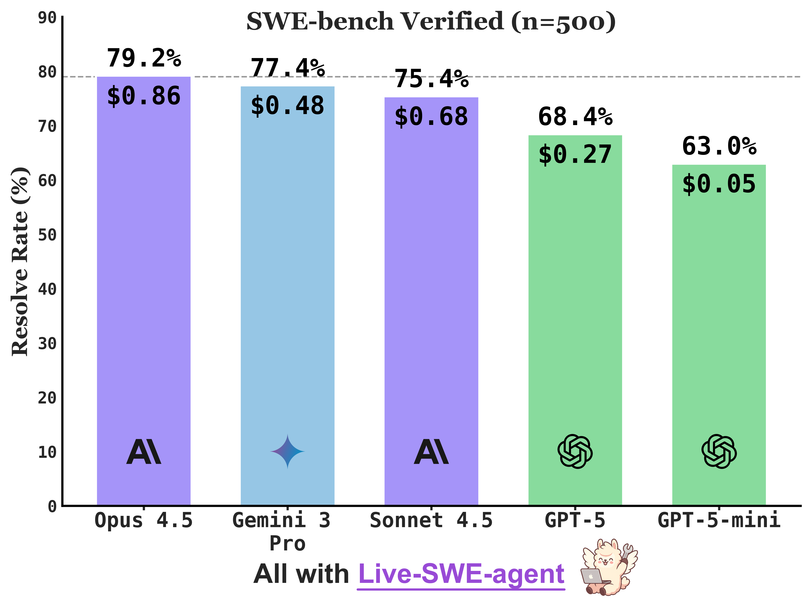

<div align="center">
<a href="https://mini-swe-agent.com/latest/"></a>
</div>

<h1 align="center">swesh | SWE-agent shell</h1>

<p align="center">
    <b>Live-SWE-agent</b><br>
    <a href="https://live-swe-agent.github.io/"></a>
    <a href="https://arxiv.org/abs/2511.13646"></a>
    <a href="https://huggingface.co/livesweagent"></a>
</p>
<p align="center">
    <b>mini-swe-agent</b><br>
    <a href="https://mini-swe-agent.com/latest/"></a>
    <a href="https://join.slack.com/t/swe-bench/shared_invite/zt-36pj9bu5s-o3_yXPZbaH2wVnxnss1EkQ"></a>
    <a href="https://pypi.org/project/mini-swe-agent/"></a>
</p>

<p align="center">
    <big><a href="#-about">ℹ️ About</a></big> |
    <big><a href="#-features">✨ Features</a></big> |
    <big><a href="#-setup">🚀 Setup</a></big> |
    <big><a href="#-usage">💻 Usage</a></big> |
    <big><a href="#-comparison">📊 Comparison</a></big> |
    <big><a href="#-attribution">📜 Attribution</a></big>
</p>

## ℹ️ About

**swesh** is an interactive CLI evolution of [Live-SWE-agent](https://github.com/OpenAutoCoder/live-swe-agent) and [mini-swe-agent](https://github.com/SWE-agent/mini-swe-agent).

It combines the **"100 lines of Python"** philosophy of `mini` with the **self-evolving** capabilities of `live`, while adding robust features for daily development.

### Why swesh?

1.  **Daemonless Execution**: Run secure, isolated environments using **Podman** without needing root access or a Docker daemon.
2.  **Robust Local AI**: Optimized for open-source models (e.g., Mistral, OpenRouter) with built-in message cleaning and fault-tolerant cost tracking.
3.  **Interactive Shell**: Enhanced generic agent shell that supports `!` commands for direct shell escape interactions.
4.  **Batch & Interactive**: Supports both single-task interactive runs and full `SWE-bench` evaluations out of the box.

---

## ✨ Features

-   **Interactive REPL w/ Shell Escape**:
    -   Inputs starting with `!` execute directly via subprocess and re-prompt the agent.
    -   Full history preservation for debugging.
-   **Native Podman Support**:
    -   Explicit `--environment-class podman` support.
    -   Works with rootless containers and user sockets.
-   **SWE-bench Verified**:
    -   Fully compatible with the official evaluation harness.
    -   Includes specific fixes (timeouts, API compatibility) for running benchmarks on consumer hardware/APIs.
-   **Generic Model Support**:
    -   Works with any OpenAI-compatible API (Mistral, Anthropic, vLLM, etc.).
    -   **RobustLitellmModel** handles API quirks automatically.

---

## 🚀 Setup

**swesh** offers flexible installation options similar to `mini-swe-agent`.

### 1. Installation

**Option 1: Local Install (Recommended)**

```bash
# Install with uv (fastest)
uv pip install -e ".[full]" swebench
```

**Option 2: Developer Setup**

```bash
git clone https://github.com/elusznik/swesh.git
cd swesh
./sync_remotes.sh   # Adds upstream remotes (live-swe-agent, mini-swe-agent)
pip install -e .
```

> **Note**: swesh tracks two upstream projects. Run `./sync_remotes.sh` periodically to pull latest changes from both.

### 2. Configure Podman (Recommended)

**swesh** is built for Podman. Ensure you have the socket enabled for compatibility:

```bash
# Install podman
sudo apt install podman

# Enable the socket
systemctl --user enable --now podman.socket

# Export the host variable (add to ~/.bashrc)
export DOCKER_HOST=unix:///run/user/$(id -u)/podman/podman.sock
```

### 3. Set API Keys

Configure your `.env` file (`~/.config/mini-swe-agent/.env`):

```bash
MISTRAL_API_KEY=...
OPENAI_API_KEY=...
ANTHROPIC_API_KEY=...
# Check https://docs.litellm.ai/docs/providers for other providers
```

See [Global Configuration](https://mini-swe-agent.com/latest/advanced/global_configuration/) for more options.

---

## 💻 Usage

### 1. Interactive Mode

Run `swesh` (or `mini`) to start an interactive session.

```bash
mini --model mistral/codestral-latest --task "Fix the bug in src/utils.py"
```

**Interactive Commands:**
-   `!ls -la`: Run a shell command directly.
-   `exit`: valid exit command.

### 2. Visual Mode

Run with `-v` to use the Textual UI (inherited from `mini-swe-agent`):

```bash
mini -v
```

### 3. Live-SWE-agent Self-Evolution

Enable the self-evolving features by using the Live-SWE-agent config:

```bash
mini --config config/livesweagent.yaml --model mistral/codestral-latest --task "Refactor the memory module"
```

### 4. SWE-bench Evaluation

Run full benchmarks on the [SWE-bench Verified](https://www.swebench.com/) dataset using Podman:

```bash
uv run src/minisweagent/run/extra/swebench.py \
  --config config/livesweagent_swebench.yaml \
  --subset verified \
  --split test \
  --model mistral/devstral-2512 \
  --slice 0:1 \
  --environment-class podman \
  --workers 1
```

See [docs/guides/running_swebench.md](docs/guides/running_swebench.md) for a full guide.

---

## 📊 Comparison

**Live-SWE-agent** (the basis for `swesh`) is the current state-of-the-art on SWE-bench Verified.

**Claude Opus 4.5 + Live-SWE-agent** scores **79.2%**, leading all open-source scaffolds.
**Gemini 3 Pro + Live-SWE-agent** scores **77.4%**.

<p align="center">

</p>

**swesh** brings these SOTA capabilities to your local command line with improved developer ergonomics.

---

## 📜 Attribution

**swesh** is built by **Nikodem Eluszkiewicz**, heavily based on the incredible work of the Live-SWE-agent and mini-swe-agent teams.

### Citing swesh

If you use this project, please cite:

```bibtex
@misc{swesh,
  author = {Eluszkiewicz, Nikodem},
  title = {swesh: Software Engineering Shell},
  year = {2025},
  howpublished = {\url{https://github.com/elusznik/swesh}},
  note = {GitHub repository}
}
```

### Original Works

Please also credit the original projects:

**Live-SWE-agent**:
```bibtex
@article{livesweagent,
  author    = {Xia, Chunqiu Steven and Wang, Zhe and Yang, Yan and Wei, Yuxiang and Zhang, Lingming},
  title     = {Live-SWE-agent: Can Software Engineering Agents Self-Evolve on the Fly?},
  year      = {2025},
  journal   = {arXiv preprint},
}
```

**SWE-agent**:
```bibtex
@inproceedings{yang2024sweagent,
  title={{SWE}-agent: Agent-Computer Interfaces Enable Automated Software Engineering},
  author={John Yang and Carlos E Jimenez and Alexander Wettig and Kilian Lieret and Shunyu Yao and Karthik R Narasimhan and Ofir Press},
  booktitle={The Thirty-eighth Annual Conference on Neural Information Processing Systems},
  year={2024},
  url={https://arxiv.org/abs/2405.15793}
}
```

### Acknowledgements
- [mini-swe-agent](https://github.com/SWE-agent/mini-swe-agent)
- [Live-SWE-agent](https://github.com/OpenAutoCoder/live-swe-agent)
- [SWE-bench](https://www.swebench.com/)
